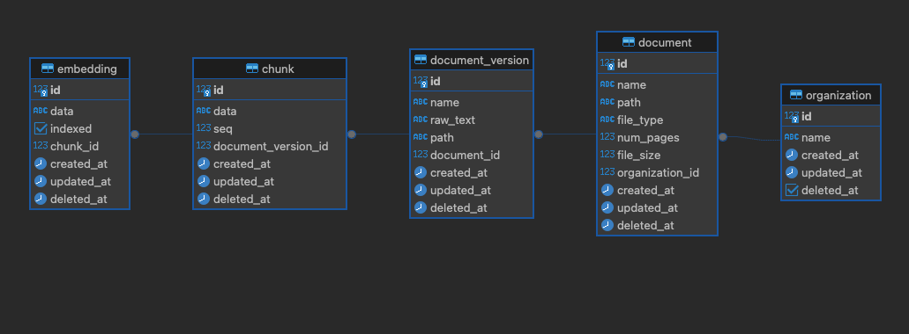

# SQL is Fun!

We'll use the following DDL and ERD for this example. This is an example of a super simple document management storage system that will power a RAG search pipeline.

## DDL

See the schema ddl [here](./schema.sql).

## ERD



## Exercises

### Design

1. In the current setup, what are the limitations of the document to document_version relationship?

**Q: How would you currently expect to get the latest document_version for a document?**\
**Q: How would you modify the schema to make versioning more explicit or obvious?**

2. Currently, we only have a single chunking strategy, but we want to explore different ways to chunk.
   examples of strategies include:
   - fixed size chunking (say every 512 characters)
   - semantic chunking (splitting on the semantic meaning/sections of a document)

**Q: How would you update the schema to support multiple chunking strategies for a document?**

3. We want to support document tagging, the criteria being:

- a tag is an alphanumeric value
- a tag may be assigned to documents to categorize and filter them
- a document can be associated with 0 or more tags
- a tag can be specific to an organization (only this org has access) or global (any organization has access)

**Q: how would you design a tagging system where documents can optionally be associated with tags?**

### Querying

1. Write a query to return the latest version (most recent created_at timestamp) of each document for a specific organization.

2. Write a query to search for chunks that contain a specific keyword (e.g., 'cloud') and return the document name, version name, and chunk data.

3. Write a query to find all documents that contain chunks where the embeddings are not indexed (indexed = false). Return the document name and version name.

4. Write a query to find document versions that have no corresponding chunks, indicating a possible data integrity issue.

5. Given the following query:

```sql
EXPLAIN ANALYZE
SELECT e.data FROM kb.document d
JOIN kb.document_version dv ON d.id = dv.document_id
JOIN kb.chunk c ON dv.id = c.document_version_id
JOIN kb.embedding e ON c.id = e.chunk_id
WHERE d.organization_id = 1;
```

And the result:

```sql
Hash Join  (cost=43.68..65.77 rows=12 width=32) (actual time=0.015..0.016 rows=0 loops=1)
  Hash Cond: (e.chunk_id = c.id)
  ->  Seq Scan on embedding e  (cost=0.00..18.70 rows=870 width=36) (actual time=0.011..0.012 rows=0 loops=1)
  ->  Hash  (cost=43.53..43.53 rows=12 width=4) (never executed)
        ->  Hash Join  (cost=21.67..43.53 rows=12 width=4) (never executed)
              Hash Cond: (c.document_version_id = dv.id)
              ->  Seq Scan on chunk c  (cost=0.00..18.60 rows=860 width=8) (never executed)
              ->  Hash  (cost=21.66..21.66 rows=1 width=4) (never executed)
                    ->  Hash Join  (cost=10.76..21.66 rows=1 width=4) (never executed)
                          Hash Cond: (dv.document_id = d.id)
                          ->  Seq Scan on document_version dv  (cost=0.00..10.70 rows=70 width=8) (never executed)
                          ->  Hash  (cost=10.75..10.75 rows=1 width=4) (never executed)
                                ->  Seq Scan on document d  (cost=0.00..10.75 rows=1 width=4) (never executed)
                                      Filter: (organization_id = 1)
Planning Time: 3.911 ms
Execution Time: 0.073 ms
```

**Q: What does this tell you about the execution pattern?**\
**Q: How could you improve performance?**

### General

1. The kb.document_version table tracks different versions of a document. How would you design a system to ensure efficient querying of the most recent version of a document while still keeping old versions for auditing?
2. Imagine multiple users are uploading documents to the system simultaneously. How would you handle concurrency in the kb.document and kb.chunk tables to prevent issues like race conditions or deadlocks?
3. Over time, many documents may become outdated or irrelevant. How would you modify the schema or design an archiving strategy to ensure old or rarely used documents and embeddings do not negatively impact performance?
4. How would you handle schema evolution for this system, especially if new fields are added to documents or embeddings? How do you ensure backward compatibility and minimal downtime?
5. In the schema, several tables have a deleted_at field for soft deletion. How would you design a mechanism to periodically clean up or archive soft-deleted records in a performant way, especially considering that this system may handle large datasets?
6. Given that new documents, chunks, and embeddings are continuously being inserted, how would you ensure that the schema remains performant with frequent writes while still supporting fast reads?
7. Looking at the current schema, are there any design decisions you would reconsider? What would you do differently, and why?
